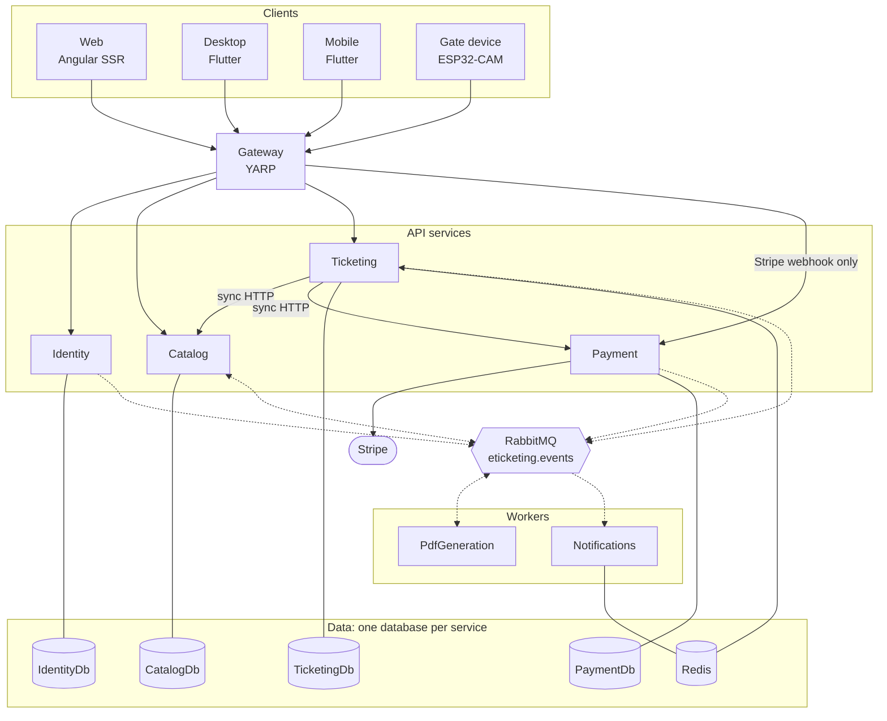
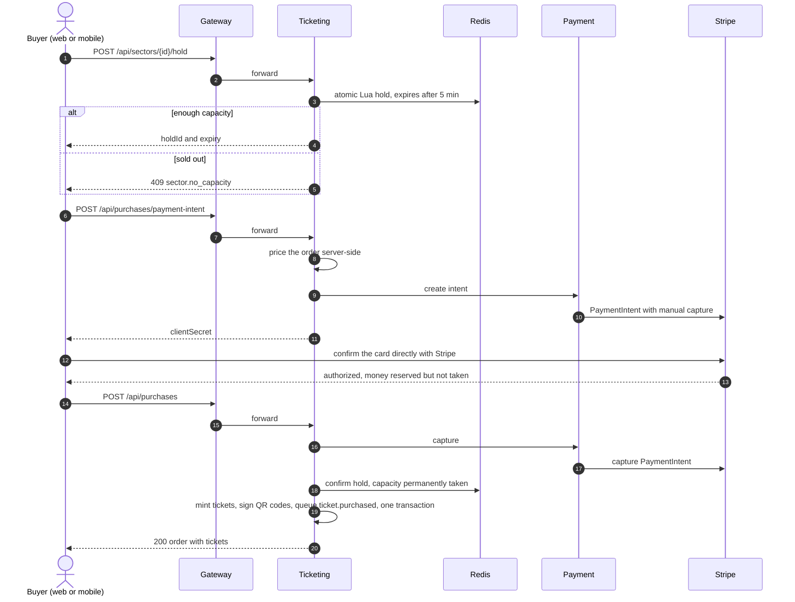
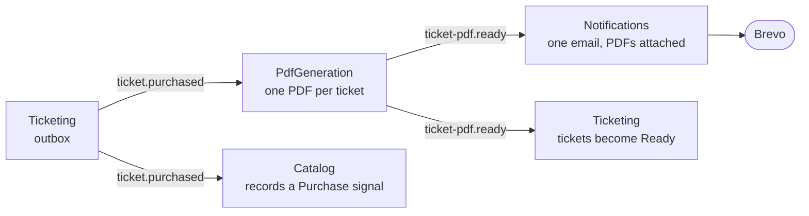
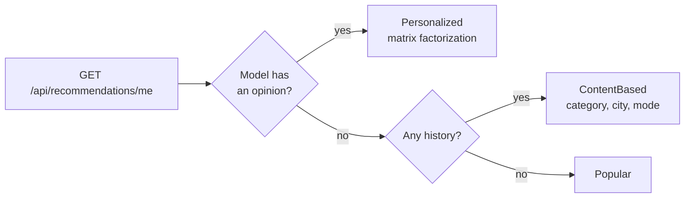
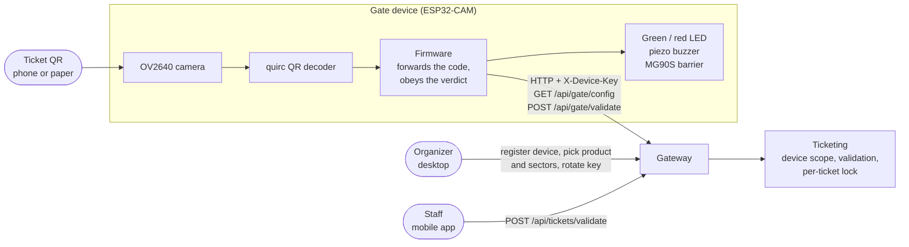

<p align="center">
  
</p>

<h1 align="center">eTicketing</h1>

<p align="center">
  A platform for selling, managing and validating electronic tickets: concerts and matches,
  museum day passes and monthly parking spaces, all on one domain model.<br>
  Built as microservices with event-driven messaging, three client apps, machine-learning
  recommendations and analytics, and an ESP32 camera gate that scans tickets at the door.
</p>

<p align="center">
  
  
  
  
  
  
  
  
  
  
  
</p>

The user interfaces are branded **eKarta** and all user-facing text is in Bosnian. Code, service
names and this documentation use **eTicketing** and English.

## Contents

- [Who does what](#who-does-what)
- [Architecture](#architecture)
- [Artificial intelligence](#artificial-intelligence)
- [IoT gate](#iot-gate)
- [How it is built](#how-it-is-built)
- [Getting started](#getting-started)

<!--
  Screenshots are hidden until the images exist, so GitHub shows no broken-image icons. To show them:
  1. Put the files in assets/readme/ with the names used below (not under docs/, which is gitignored).
  2. Delete the SCREENSHOTS-START line and the SCREENSHOTS-END line.
  3. Add "- [Screenshots](#screenshots)" to the Contents list.
-->
<!-- SCREENSHOTS-START

## Screenshots

<table>
  <tr>
    <td width="50%"><br><sub><b>Web</b>: storefront and personalised recommendations</sub></td>
    <td width="50%"><br><sub><b>Web</b>: checkout with a five-minute seat hold and Stripe</sub></td>
  </tr>
  <tr>
    <td><br><sub><b>Desktop</b>: back-office dashboard</sub></td>
    <td><br><sub><b>Desktop</b>: AI Uvidi (forecast, anomalies, audience segments)</sub></td>
  </tr>
  <tr>
    <td><br><sub><b>Desktop</b>: gate devices and their scope</sub></td>
    <td> <br><sub><b>Mobile</b>: events and door validation</sub></td>
  </tr>
  <tr>
    <td><br><sub><b>IoT</b>: the gate hardware</sub></td>
    <td><br><sub><b>IoT</b>: a valid ticket lifts the barrier</sub></td>
  </tr>
</table>

SCREENSHOTS-END -->

## Who does what

There are four staff roles in two tiers, plus buyers:

- The **platform tier** (SuperAdmin, Admin) runs the platform as a whole.
- The **organization tier** (OrganizationSuperAdmin, OrganizationAdmin) runs a single organization,
  such as an event organizer, a museum or a parking operator.
- **Buyers** (User) shop and hold tickets.

Staff work in the **desktop** back office, which refuses buyer accounts. Buyers use the **web**
storefront and the **mobile** app. All four staff roles also get a *Validacija* tab in the mobile
app for scanning tickets at the door. The server enforces every rule below; a hidden button is
never the only safeguard.

### Organization tier

**Organization SuperAdmin**: exactly one per organization, created together with it.

- Runs the organization's catalogue: products and their sectors, with prices, capacities and ticket
  types. Each goes through **create as draft → preview → publish**, and stays live when edited.
- Registers gate devices, chooses which product and sectors each door admits, and rotates device
  keys.
- Sees the organization's **Prodaja** (sales), **Proizvodi** (products), **Iskorištenost**
  (redemption) and **AI Uvidi** reports, and can export them to PDF.
- Is the only organization role that manages staff: they add, edit and remove the organization's
  OrganizationAdmin accounts.
- Prints batches of paper tickets for box-office sale, and validates tickets with the mobile app.

**Organization Admin**: day-to-day staff of one organization.

- Does the same catalogue, gate-device, printing and validation work as the Organization SuperAdmin.
- Sees Prodaja, Proizvodi and AI Uvidi, but not redemption statistics, and cannot export reports.
- Cannot manage any user accounts.

### Platform tier

**SuperAdmin**: owns the platform.

- Creates organizations, each with its first OrganizationSuperAdmin account, and edits or deletes
  them.
- Creates, edits and deletes platform Admin accounts, and manages the staff of any organization.
  Deleting an OrganizationAdmin requires a reason, which is emailed to that person.
- Overrides any organization's products, sectors, gate devices and print batches, reached through
  *Organizacije* → organization detail.
- Manages categories and their ticketing mode, and monitors or retrains the recommendation model.
- Sees all five report tabs platform-wide, including revenue and AI Uvidi.

**Admin**: platform operations staff.

- Has the same override as SuperAdmin over products, sectors, gate devices and print batches, plus
  categories, organization details and the recommendation model.
- Cannot create or delete organizations, create Admin accounts, or manage an organization's staff.
- Does not see revenue: only the Proizvodi and Organizacije report tabs, with no Prodaja,
  Iskorištenost or AI Uvidi.

### Buyers

- Browse published events, museums and parking without signing in on the web. The mobile app
  requires an account.
- Get personalised recommendations and "similar products" on product pages.
- Buy through a five-minute capacity hold and Stripe checkout, receive one PDF per ticket by email,
  and show a signed QR code at the door.
- Book monthly parking as a real Stripe subscription that renews itself, and cancel it from the
  profile.

### Permission matrix

| Capability | SuperAdmin | Admin | Org SuperAdmin | Org Admin | Buyer |
|---|:-:|:-:|:-:|:-:|:-:|
| Create or delete organizations | ✅ | — | — | — | — |
| Edit organization details and logo | ✅ | ✅ | — | — | — |
| Manage platform Admin accounts | ✅ | — | — | — | — |
| Manage organization staff | any org | — | own org¹ | — | — |
| Categories and their ticketing mode | ✅ | ✅ | — | — | — |
| Products and sectors (draft → preview → publish) | any org | any org | own org | own org | — |
| Gate devices | any org | any org | own org | own org | — |
| Paper ticket print batches | any org | any org | own org | own org | — |
| Validate tickets with the mobile app | any org | any org | own org | own org | — |
| Report: Prodaja (sales) and AI Uvidi | platform | — | own org | own org | — |
| Report: Proizvodi (products) | platform | platform | own org | own org | — |
| Report: Iskorištenost (redemption) | platform | — | own org | — | — |
| Report: Organizacije | platform | platform | — | — | — |
| Export reports to PDF | ✅ | ✅ | ✅ | — | — |
| Recommendation model status and retraining | ✅ | ✅ | — | — | — |
| Shop: holds, checkout, my tickets, subscriptions | — | — | — | — | ✅ |

¹ OrganizationAdmin accounts only. There is exactly one OrganizationSuperAdmin per organization, and
only a SuperAdmin can create it.

### One model, three kinds of ticket

What a product, a sector and a ticket mean is decided by the product's **category**, through its
`TicketingMode`. A new museum or parking operator needs no code change, only a category with the
right mode.

| Ticketing mode | Example | A sector is | The buyer chooses |
|---|---|---|---|
| `SingleOccurrence` | Concert, match | A seating section with a fixed capacity, for one fixed date | A sector |
| `DailyEntry` | Museum day pass | One month of day passes, with capacity counted per day | A sector and a day |
| `RecurringReservation` | Monthly parking | One labelled space, capacity 1 | A space, billed monthly by Stripe |

## Architecture

eTicketing is a **hybrid of microservices and event-driven architecture**. The rule that decides
which half a step belongs to:

- **Anything the buyer waits for is synchronous.** Hold, payment and purchase happen over HTTP,
  because the buyer needs an immediate yes or no.
- **Anything that follows from a completed action is asynchronous.** PDF rendering, emails and
  recommendation signals travel over RabbitMQ, so a slow email provider never slows a purchase.



<sub>Solid arrows are synchronous HTTP, dotted arrows are RabbitMQ events, and plain lines connect a service to its data.</sub>

### Services

| Unit | Kind | Owns | Responsibility |
|---|---|---|---|
| **Gateway** | YARP reverse proxy | — | The only public API entry point: routing and edge authentication |
| **Identity** | API + SQL | Users, organizations, refresh tokens | Registration, login, session cookies, organization and staff accounts |
| **Catalog** | API + SQL | Categories, products, images, user interactions | Product catalogue, draft → publish, public browsing, **recommendations** |
| **Ticketing** | API + SQL + Redis | Sectors, tickets, subscriptions, gate devices, print batches | Capacity holds, purchases, tickets, door validation, reports, **AI Uvidi** |
| **Payment** | API + SQL | Payments, Stripe events and customers | Everything that talks to Stripe, including the webhook |
| **Notifications** | Worker | — (Redis for de-duplication) | Turns events into emails through Brevo |
| **PdfGeneration** | Worker | — | Renders one PDF per ticket with QuestPDF |

Services are split along three lines. Things that must change together stay together: holding
capacity and minting the tickets that use it is one transaction, which is why sectors live in
Ticketing and not next to products in Catalog. Different load profiles are kept apart. And
secrets stay isolated: only Payment knows the Stripe key.

### Buying a ticket



The card never touches the platform. Because the payment is only *authorized* until the final
step, a hold that expires mid-checkout cancels an authorization instead of needing a refund. If
Payment is down, a circuit breaker opens: the hold is released and the buyer gets a clear `503`.

After the purchase, everything else happens asynchronously:



### Key design decisions

- **One public door.** The gateway is the only public API entry point, and it validates the
  session before forwarding. The service containers publish no ports at all. Payment is reachable
  from outside only through the exact path of the Stripe webhook, which is verified by signature.
- **Database per service.** No service reads another service's tables.
- **A closed list of two synchronous calls between services**: Ticketing → Catalog, when an
  organizer creates a sector, and Ticketing → Payment. Both use Polly retry and timeout, and
  Payment also has a circuit breaker.
- **Local read models instead of more calls.** Ticketing keeps event-fed copies of products and
  organizations (`ProductSnapshot`, `OrganizationSnapshot`), so the buying path never waits on
  Catalog or Identity. A product deleted in Catalog stops selling as soon as the event arrives.
- **Atomic capacity in Redis.** A hold is one Lua script that checks and reserves in a single
  step, so two buyers can never both take the last seat, however many Ticketing replicas run.
- **Transactional outbox and inbox.** Events are written in the same database transaction as the
  data that caused them and dispatched afterwards. Consumers record each message id in the same
  transaction as their own writes, so a redelivered event is never processed twice.
- **Draft → preview → publish** for products and sectors. Preview is stateless and runs the full
  validation without writing anything. Public endpoints return published items only.
- **Sessions in httpOnly cookies.** JWTs live in httpOnly cookies, with refresh-token rotation and
  reuse detection. The web app proxies `/api` through its own origin, so the cookies can be
  `SameSite=Strict`.
- **Result pattern.** Expected failures (not found, validation, conflict, forbidden) are returned
  as values with a stable error code and mapped to HTTP in one place. Exceptions are only for bugs.

## Artificial intelligence

Both AI components use **ML.NET** in-process, inside the service that already owns their data.
There is no separate model server and no second programming language. Each one falls back to a
simpler method when data is scarce, and always tells the user which method produced the answer.

| | Recommendations | AI Uvidi (sales analytics) |
|---|---|---|
| For | Buyers (web and mobile) | Organizers and SuperAdmin (desktop) |
| Lives in | Catalog | Ticketing |
| Learns from | Product views and purchases | Daily sales and per-buyer purchase history |
| Methods | One-class matrix factorization, then content-based and popularity fallbacks | SSA forecasting, SSA plus MAD anomaly detection, K-Means over RFM, a rules engine, an optional LLM |
| Training | Nightly full retrain, model stored in private blob storage | Fitted per request on the selected range, never stored |

### Recommendations

- **Signals.** A buyer opening a product page records a `View`, and a completed purchase records a
  `Purchase` through the `ticket.purchased` event. Each (user, product, type) is one row with a
  counter. No money, orders or tickets are stored in Catalog.
- **Model.** ML.NET `MatrixFactorizationTrainer` with a one-class loss. The platform has no
  ratings, only positive signals, and one-class factorization is designed for exactly that kind of
  data.
- **Training.** Retrains nightly at 03:00 by default, or on demand from the desktop *Preporuke*
  screen. The trained model is saved to blob storage and loaded on startup, so a restarted
  container does not start cold.
- **A row is never empty.** Every response carries its `Source`, and the UI titles the row to
  match:



### AI Uvidi (sales insights)

The fifth tab of the desktop *Izvještaji* screen (`GET /api/reports/insights`) answers three
questions for an organizer: what will probably happen, what was unusual, and who is buying.

- **Forecast.** Singular Spectrum Analysis (`ForecastBySsa`) projects revenue forward with a 95 %
  confidence band.
- **Anomalies.** SSA spike detection is combined with a robust median-absolute-deviation z-score,
  which a few extreme days cannot inflate the way they inflate a standard deviation.
- **Audience segments.** K-Means clusters buyers by recency, frequency and monetary value (RFM)
  over the trailing 365 days. RFM over a single week is mostly noise.
- **Findings.** A deterministic rules engine turns all of the above, plus the regular reports,
  into plain-language business insights in Bosnian.
- **Honest fallbacks.** Each block reports `Model`, `Heuristic` or `Insufficient`. The model needs
  at least 28 daily points for SSA and 20 buyers for K-Means.
- **Optional LLM summary.** Any OpenAI-compatible endpoint can write a short summary on top:
  Ollama locally (`docker compose --profile ai up -d`), Groq or OpenRouter. It is off by default,
  and every failure path returns nothing rather than failing the report.

## IoT gate

A physical turnstile for the door. An **ESP32-CAM** reads the QR code on a ticket (printed or on a
phone), asks the platform whether it admits the holder, and shows the answer with LEDs, a buzzer
and a servo-driven barrier.



Two principles shape the whole design:

1. **The device decides nothing.** The firmware holds no signing key, no product id and no sector
   list. The server checks the QR signature, event, sector, date and prior use against the scope
   stored for the device's key. Re-flashing a board cannot widen what it admits, and re-scoping a
   door needs no re-flash.
2. **It fails closed.** Only an explicit, well-formed "valid" answer opens the barrier. A network
   error, timeout, unreadable response or rejected key keeps it shut, and the barrier is driven
   closed at every boot.

On the server, device keys are stored only as SHA-256 hashes. A per-ticket lock in Redis stops the
same ticket from getting through two doors at once. The mobile app's scan tab calls the **same
validation core**, so a phone is a full backup for a gate.

| Part | Role |
|---|---|
| AI-Thinker ESP32-CAM (OV2640, 4 MB PSRAM) | Camera, QR decoding and Wi-Fi in one module |
| ESP32-CAM-MB carrier | USB flashing and serial monitor |
| MG90S servo, continuous rotation (360°) | The barrier, on its **own 5 V supply** with a 470–1000 µF capacitor |
| Green and red LEDs, passive piezo | The verdict, as light and pitch |
| Mechanical stop at the closed position | Lets the firmware re-find "closed" at boot |

| Outcome | LED | Buzzer | Barrier |
|---|---|---|---|
| Valid | Green | Rising chime | Up for 3 s, then down |
| Rejected (wrong sector, used, forged, expired) | Red | One long low tone | Stays down |
| Another scanner is validating this ticket right now | Green and red | Two mid tones | Stays down |
| Network error or timeout | Red, fast blinks | Two short low tones | Stays down |

**Quick start.** Register the gate in the desktop app under *Ulazni uređaji* and copy its one-time
key. Then fill in `IoT/include/config.h` from `config.example.h` (Wi-Fi, gateway LAN address, key)
and flash it:

```bash
cd IoT
pio run -t upload -t monitor
```

The full wiring, pin map, diagnostics page and troubleshooting guide are in
[IoT/README.md](IoT/README.md).

## How it is built

### Repository layout

```text
eTicketing/
├── backend/
│   ├── gateway/            YARP reverse proxy, the only public API entry
│   ├── services/           identity, catalog, ticketing, payment, notifications, pdfgeneration
│   ├── shared/             Contracts, Shared.Auth, Shared.Messaging, Shared.Storage, Shared.TicketPdf
│   ├── tests/              xUnit test projects
│   └── eTicketing.sln
├── frontend/
│   ├── web/                Angular SSR storefront for buyers
│   ├── desktop/            Flutter back office for staff
│   └── mobile/             Flutter app for buyers, plus door validation for staff
├── IoT/                    ESP32-CAM gate firmware (PlatformIO)
├── .github/workflows/      one CI/CD pipeline per deployable unit
└── docker-compose.yml      the whole stack, configured by one root .env
```

### Backend conventions

- **Three projects per API service**, with dependencies in one direction only: `Api → Business →
  Data`. The two workers and the gateway are single projects.
- **Minimal APIs**, grouped per feature. Validation runs as an endpoint filter with
  **FluentValidation**, and mapping uses **Mapster**.
- **EF Core** on SQL Server. Migrations apply automatically on startup.
- **Shared libraries** hold what must never drift between services: error and paging contracts,
  cookie/JWT authentication and role policies, the RabbitMQ outbox, inbox and consumers, blob
  storage, and the ticket PDF layout.

### Tech stack

| Area | Technology |
|---|---|
| Backend | .NET 10, ASP.NET Core Minimal APIs, EF Core, FluentValidation, Mapster, Polly |
| Gateway | YARP 2.3 |
| Messaging and state | RabbitMQ (topic exchange), Redis 7, SQL Server 2022 |
| Payments | Stripe.net, behind a provider seam with a `Mock` fallback |
| Documents and email | QuestPDF, Brevo, Azure Blob Storage |
| Machine learning | ML.NET 5.0 (Recommender, TimeSeries, K-Means) |
| Web | Angular 21 with server-side rendering |
| Desktop and mobile | Flutter (Dart 3.10) with `dio` and a persistent cookie jar |
| IoT | ESP32-CAM, Arduino core via PlatformIO (`espressif32@6.9.0`), quirc, ArduinoJson |
| Runtime and delivery | Docker Compose locally, Azure Container Apps in the cloud, GitHub Actions |

### Delivery

Every deployable unit (six services, the gateway and the web app) has its own GitHub Actions
workflow. A workflow runs only when its own folder or the shared libraries change. It builds the
image in Azure Container Registry, tags it with the commit SHA, and rolls it out to its Azure
Container App. Sign-in uses OpenID Connect, so no long-lived Azure password is stored in the
repository.

### Tests

The backend has eight xUnit test projects. Service tests run against a real SQLite in-memory
database with real repositories, and mock only genuine external systems such as the message bus
and other services' HTTP clients.

```bash
dotnet test backend/eTicketing.sln
```

## Getting started

### Prerequisites

- **Docker Desktop** runs the whole stack.
- Optional: the .NET 10 SDK, Node.js and Flutter (to run pieces outside Docker), the Stripe CLI (for
  real test-mode payments), and PlatformIO (for the gate).

### 1. Create the `.env` file

The whole stack is configured by one `.env` file in the repository root, which is gitignored.
Compose refuses to start without the six required values.

<details>
<summary><b>Environment variables</b></summary>

**Required**

| Variable | Used for |
|---|---|
| `SA_PASSWORD` | SQL Server `sa` password, which must meet SQL Server's complexity rules |
| `JWT_SIGNING_KEY` | Signing the session tokens, shared by every service |
| `QR_SIGNING_KEY` | Signing ticket QR codes |
| `AZURE_STORAGE_CONNECTION_STRING` | Product images, logos, icons, generated PDFs and the recommendation model |
| `BREVO_API_KEY`, `BREVO_SENDER_EMAIL` | Transactional email (verification codes, tickets, notices) |

**Optional** (default in brackets)

| Variable | Used for |
|---|---|
| `PAYMENT_PROVIDER` (`Mock`) | Set to `Stripe` for real test-mode payments |
| `STRIPE_SECRET_KEY`, `STRIPE_PUBLISHABLE_KEY`, `STRIPE_WEBHOOK_SECRET` | Required when the provider is `Stripe` |
| `STRIPE_CURRENCY` (`eur`) | Charge currency. Prices still display in KM |
| `BREVO_SENDER_NAME` (`eKarta`) | Email sender name |
| `SUPPORT_EMAIL`, `SUPPORT_PHONE` | Support contact shown to buyers |
| `GATEWAY_PORT` (`5000`), `WEB_PORT` (`4200`) | Public ports |
| `SQLSERVER_PORT` (`1433`), `REDIS_PORT` (`6379`), `RABBITMQ_MANAGEMENT_PORT` (`15672`) | Developer access, with SQL Server and Redis bound to loopback |
| `CORS_ALLOWED_ORIGIN` (`http://localhost:4200`) | Allowed browser origin |
| `JWT_ACCESS_TOKEN_MINUTES` (`15`), `JWT_REFRESH_TOKEN_DAYS` (`14`) | Session lifetimes |
| `NG_APP_GOOGLE_MAPS_API_KEY` | Map on the web product page |
| `MOBILE_API_BASE_URL` (`http://10.0.2.2:5000/api/`) | Gateway address baked into the APK (`10.0.2.2` is the host as seen from the Android emulator) |
| `DESKTOP_API_BASE_URL` (`http://localhost:5000/api/`) | Gateway address baked into the desktop build |
| `INSIGHTS_NARRATIVE_PROVIDER` (`None`) | Set to `OpenAiCompatible` to enable the AI Uvidi summary |
| `INSIGHTS_NARRATIVE_BASE_URL`, `_MODEL`, `_API_KEY`, `_TIMEOUT_SECONDS`, `_MAX_TOKENS` | The LLM endpoint. Defaults point at the local Ollama container |

</details>

### 2. Start everything

```bash
docker compose up -d --build
```

| What | Where |
|---|---|
| Web storefront | http://localhost:4200 |
| API gateway (desktop, mobile, gate, Stripe webhook) | http://localhost:5000 |
| RabbitMQ management UI | http://localhost:15672 |

Database migrations and seed data apply automatically when the services start.

<details>
<summary><b>Seeded accounts</b> (local development data)</summary>

| Role | Username | Password | Organization |
|---|---|---|---|
| SuperAdmin | `superadmin` | `SuperAdmin123!` | — |
| OrganizationSuperAdmin | `emir.kovacevic` | `OrgAdmin123!` | Sarajevo Events |
| OrganizationAdmin | `lejla.begic` | `OrgAdmin123!` | Sarajevo Events |
| OrganizationSuperAdmin | `ivan.maric` | `OrgAdmin123!` | Mostar Sport Arena |

Buyers are not seeded. Register on the web (`/registracija`) or in the mobile app, and confirm the
email with the six-character code. A platform Admin can be created from the desktop app, signed in
as `superadmin`: *Korisnici* → *Dodaj Administratora Platforme*.

</details>

<details>
<summary><b>Payments in Stripe test mode</b></summary>

Set `PAYMENT_PROVIDER=Stripe` and the three Stripe keys from the Stripe test dashboard. Then forward
webhooks to the gateway and keep this running. Subscription renewals depend on it:

```bash
stripe login
stripe listen --forward-to http://localhost:5000/api/payments/webhook
```

Copy the printed `whsec_...` value into `STRIPE_WEBHOOK_SECRET` and restart `payment-service`.

| Card | Result |
|---|---|
| `4242 4242 4242 4242` | Success |
| `4000 0000 0000 0002` | Declined |
| `4000 0027 6000 3184` | Asks for 3-D Secure confirmation |

`stripe trigger invoice.paid` simulates a monthly parking renewal without waiting a month. With
`PAYMENT_PROVIDER=Mock` (the default), no keys are needed and a simple card form appears instead:
`4111 1111 1111 1111` succeeds and `4111 1111 1111 0000` is declined.

</details>

<details>
<summary><b>AI Uvidi summary with a local LLM</b></summary>

```bash
docker compose --profile ai up -d
docker exec eticketing-ollama ollama pull llama3.2:3b
```

Set `INSIGHTS_NARRATIVE_PROVIDER=OpenAiCompatible` and restart `ticketing-service`. A small local
model on a CPU is slow, so raise `INSIGHTS_NARRATIVE_TIMEOUT_SECONDS`. A hosted OpenAI-compatible
API such as Groq answers in a few seconds.

</details>

### 3. Build the Flutter apps

Flutter apps cannot run as long-lived containers, but Docker can build them as one-shot jobs
behind the `build` profile:

```bash
docker compose --profile build run --rm mobile-build     # -> ./dist/mobile/app-release.apk
docker compose --profile build run --rm desktop-build    # -> ./dist/desktop/ (Linux bundle)
```

Docker can produce only an Android APK (iOS needs a macOS host) and a Linux desktop bundle. Build
Windows or macOS desktop apps natively with `flutter build windows` or `flutter build macos` from
`frontend/desktop`.

<p align="center">
  Built by Nihad Mandžo as a diploma thesis project.
</p>
