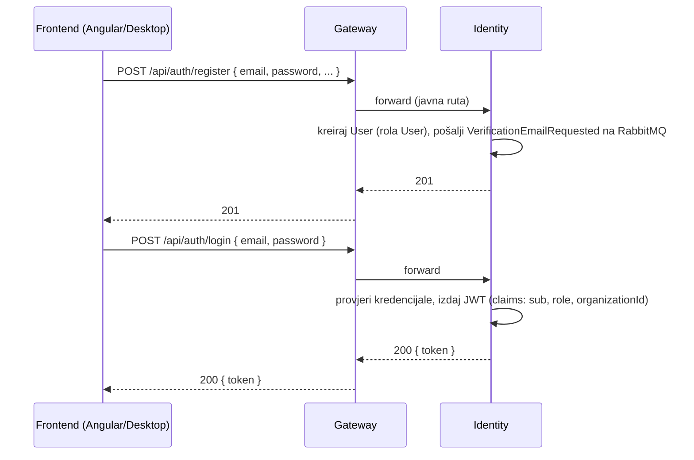
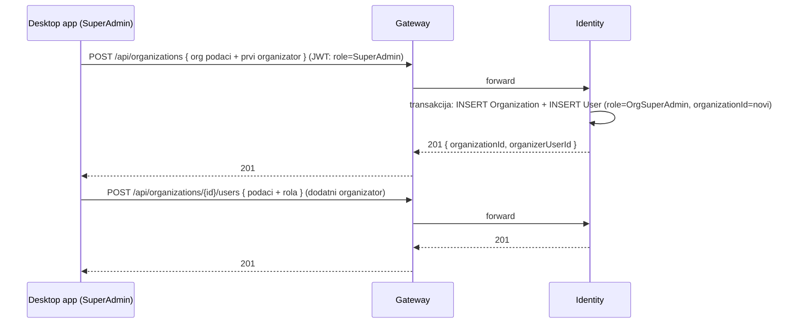
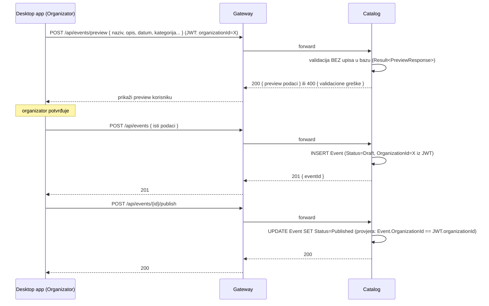
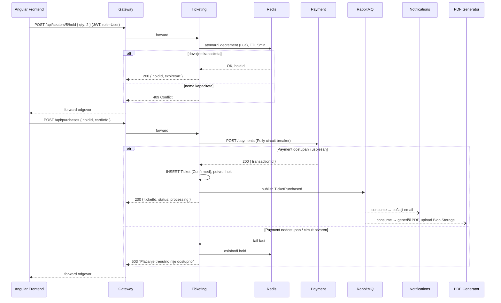
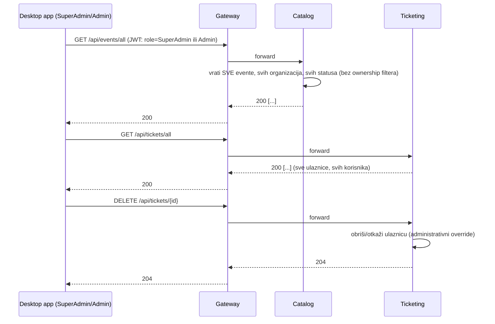

# Detaljan tok: API Gateway ↔ Frontend ↔ Servisi (potpuni rewrite)

> Prati [arhitektura-migracija-mikroservisi-eda.md](arhitektura-migracija-mikroservisi-eda.md). Cijeli backend je nov — ovaj dokument opisuje finalni, ciljni tok.

## 0. Klijenti i princip izolacije

Dva klijenta, oba isključivo kroz Gateway: `frontend/web` (Angular, customer) i `frontend/desktop` (Flutter, Admin/Organizator). U `docker-compose.yml` **samo** `eTicketing.Gateway` ima port publikovan ka hostu; svi ostali servisi su dostupni isključivo unutar internog Docker network-a.

`eTicketing.Payment` **nema nijednu javnu rutu kroz gateway** — dostupan je isključivo servisu `eTicketing.Ticketing`, interno.

```
                         Host mašina (izloženo javno)
                                    │  http://localhost:5000
                                    ▼
                    ┌───────────────────────────────┐
                    │   eTicketing.Gateway (YARP)    │
                    │   JWT autentikacija, routing    │
                    └───────────────┬─────────────────┘
                                     │  interni Docker network
        ┌────────────────┬──────────┼───────────┬─────────────────┐
        │                 │          │            │                 │
 ┌──────▼─────┐   ┌───────▼──────┐  ┌▼───────────┐ │        (Payment nije
 │  identity   │   │   catalog     │  │ ticketing   │ │         rutiran kroz
 │  (interno)  │   │  (interno)    │  │ (interno)   │ │         gateway)
 └──────┬──────┘   └───────┬───────┘  └─────┬───────┘ │
        │                  ▲                 │         │
        │        (2) interni poziv           │         ▼
        │        Ticketing → Catalog          │   ┌───────────┐
        │        (provjera vlasništva          │   │  payment   │
        │         eventa nad sektorom,          │   │ (SAMO       │
        │         Polly retry/timeout)          │   │  interno)   │
        │                                       │   └───────────┘
        │                                       │  (1) Ticketing → Payment
        │                                       │      (Polly circuit breaker)
        │                                       ▼
        │                              ┌────────────────┐
        │                              │    RabbitMQ     │
        │                              └───────┬──────────┘
        │                          ┌────────────┴────────────┐
        │                          ▼                          ▼
        │                ┌──────────────────┐      ┌──────────────────┐
        └───────────────▶│ notifications-svc │      │ pdf-generation-svc│
        (VerificationEmail│                    │      │                    │
         Requested)       └──────────────────┘      └──────────────────┘
```

## 1. Tabela rutiranja

| Path prefiks (javno, kroz Gateway) | Cilja servis | Zahtijeva JWT? | Rola |
|---|---|---|---|
| `/api/auth/**` | Identity | Ne (register/login javni) | — |
| `/api/organizations/**` | Identity | Da | `SuperAdmin` (write), `Organizer` (`GET` svoje) |
| `/api/admins/**` | Identity | Da | `SuperAdmin` |
| `/api/categories/**` | Catalog | Da (pisanje), Ne (čitanje) | `PlatformStaff` (pisanje) |
| `/api/events/**` | Catalog | Da (pisanje/preview/publish/mine/all), Ne (`GET` liste/pojedinačnog, samo `Published`) | `Organizer` (svoje), `PlatformStaff` (sve) |
| `/api/sectors/**` | Ticketing | Da (pisanje/preview/publish/hold), Ne (čitanje `Published`) | `Organizer` (svoje), `PlatformStaff` (sve) |
| `/api/purchases/**` | Ticketing | Da | `User` |
| `/api/tickets/**` | Ticketing | Da | `User` (svoje), `PlatformStaff` (sve, uklj. edit/delete) |
| — (nema javnu rutu) | Payment | — | samo interno, `Ticketing → Payment` |
| — (nema javnu rutu) | Notifications, PdfGeneration | — | samo RabbitMQ konzumenti |

> **Interne (ne-gateway) rute između servisa:** `Ticketing → Catalog`: `GET /internal/events/{id}` (vraća minimalan DTO: `Id`, `OrganizationId`, `Status`) — koristi se isključivo za provjeru vlasništva pri kreiranju/izmjeni sektora, nikad ne prolazi kroz gateway.

## 2. Tok registracije i logina



## 3. SuperAdmin — kreiranje organizacije i organizatora



## 4. Organizator — kreiranje eventa sa preview/publish obrascem



Isti obrazac (`preview` → `create/update` → `publish`) ponavlja se identično za `POST /api/sectors/preview` u `Ticketing`, s tom razlikom da `Ticketing` dodatno interno poziva `Catalog` (`GET /internal/events/{id}`) da potvrdi da `EventId` iz zahtjeva pripada organizaciji pozivaoca prije nego dozvoli kreiranje sektora.

## 5. Kompletan tok kupovine



## 6. SuperAdmin/Admin override


